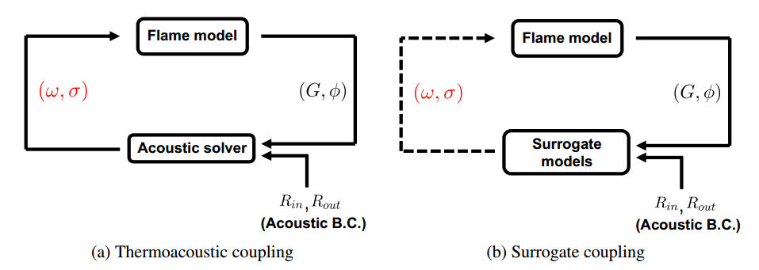
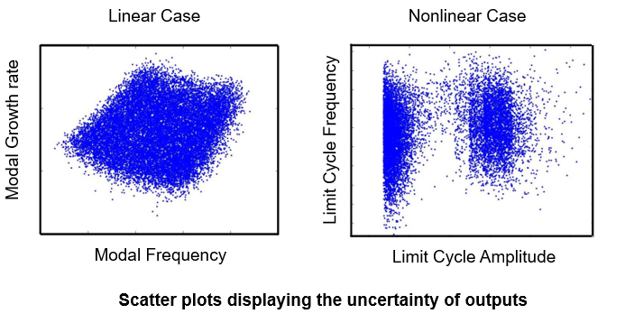

## ML-Enhanced Risk Analysis Under multiple Uncertainty Sources

  

### 1. Highlight

- eveloped a physics-informed, data-driven strategy to perform efficient combustion instability risk analysis under multiple sources of uncertainty.
- We isolated the system components according to their simulation expenses and uncertainty nature.
- We built Gaussian Process models to surrogate the expensive-to-simulate component and designed an iterative loop to couple the GP models with the other component simulations.
- Our strategy led to 20/15 times accelerations in computational efficiency for linear/nonlinear instability risk calculations.

This work was firstly presented in [38th International Symposium on Combustion](http://www.combustionsymposia.org/2021/home), and was later published in the journal:

Guo S., Silva C. F., Polifke W., [A Gaussian-process-based framework for high-dimensional uncertainty quantifcation analysis in thermoacoustic instability predictions](https://www.sciencedirect.com/science/article/abs/pii/S1540748920303217). *Proceedings of the Combustion Institute*, 2020, in press.

### 2. Motivation

Accurately predict combustion instability is crucial for the gas turbine industry. However, this goal is not easy to achieve due to various input uncertainties, including acoustic and flame model parameters. What's more challenging is that flame model uncertainties are usually high-dimensional.

Previously, we have successfully employed data-driven approaches to propagate high-dimensional flame model uncertainties to the instability calculation. However, in that study, uncertainties from aoustic models were not taken into account.

### 3. Methodology

To fill the current gap, we developed a general data-driven risk analysis framework that can handle uncertainties from both acoustic system parameters and high-dimensional flame models:

Instead of building naive machine learning models that input primary variables (i.e., acoustic and flame model parameters), we leveraged the **domain knowledge** and trained models on two intermediate variables, flame gain and phase. This is possible as no matter how high-dimensional the employed flame model is, the acoustic solver, which takes up the most computational resources, only requires the flame gain and phase for its calculation. In this way, we can deal with any frequency-dependent flame model, thus potentially achieving significant dimensionality reduction.

Meanwhile, **active learning** strategy is adopted to accelerate model training.

### 4. Results

- Our employed active learning scheme significantly reduced the training cost.

- For a risk analysis task of 65-dimensional linear combustion instability prediction, our proposed strategy delivered a 20-fold increase in computational efficiency.

- For a risk analysis task of 523-dimensional nonlinear combustion instability prediction, our proposed strategy delivered a 15-fold increase in computational efficiency.

  

### 5. Folder structure

**1. Presentation**: the slides presented in [38th International Symposium on Combustion](http://www.combustionsymposia.org/2021/home).

**2. MatlabScripts**: MATLAB source code and data to reproduce the results. The code and data are organized in individual folders corresponding to different sections in the paper. 

- **FTF_FIR_Convert**: generate reference FIR model from the discrete experimental frequency response data. This folder is associated with **Section 4.3: Case study-linear thermoacoustic UQ analysis**

- **FIR_uncertainty_generation**: generate the noisy velocity and heat release fluctuation signals, and identify the uncertain FIR model.  This folder is associated with **Section 4.3: Case study-linear thermoacoustic UQ analysis**

- **LinearUQ**: Produce the reference Monte Carlo results for the linear UQ case study. This folder is associated with **Section 4.3: Case study-linear thermoacoustic UQ analysis**

- **NonlinearUQ**: FDF uncertainty generation, Monte Carlo results, GP-based results associated with **Section 4.4: Case study-nonlinear thermoacoustic UQ analysis**

- **Surrogate**: GP models training (**Section 4.2: GP model training**) and GP-based results associated with **Section 4.3: Case study-linear thermoacoustic UQ analysis**

Pre-install UQLab (www.uqlab.com) is necessary to run the code